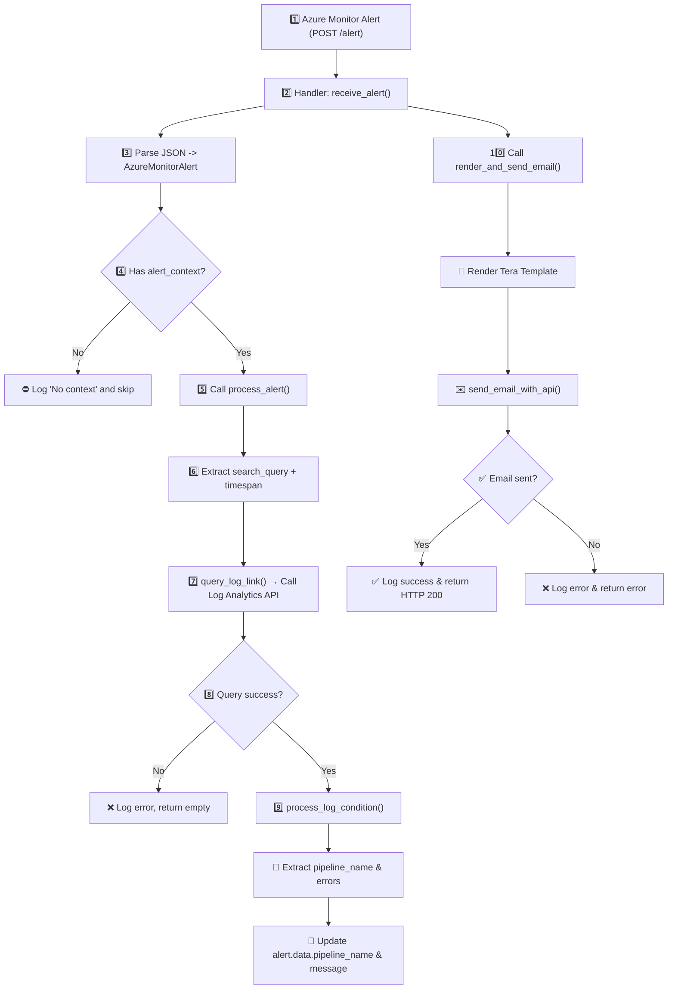

# azure-monitor-alert-listener

**azure-monitor-alert-listener** is a lightweight application developed to test and handle incoming alerts from **Azure Monitor**, specifically for **Azure Data Factory (ADF)**.  
It acts as a simple **Webhook endpoint** that listens for alert notifications using the [Azure Monitor Common Alert Schema](https://learn.microsoft.com/en-us/azure/azure-monitor/alerts/alerts-common-schema).

## 📌 Purpose

This project was built to:
- Simulate a Webhook endpoint to receive alerts from Azure Monitor
- Debug and inspect ADF alert payloads in real-time
- Experiment with binding alert data to templates or forwarding to other systems (e.g., email, message queue)

## 🚀 Features

- HTTP POST endpoint (`/alert`) to receive alerts
- JSON schema parsing based on Azure Monitor Common Alert Schema
- Logging / inspection of alert details (e.g. alertRule, severity, firedDateTime)
- Designed to integrate with email or notification systems (coming soon)

## 🧱 Technology Stack

- [Rust 🦀](https://www.rust-lang.org/)
- [actix-web](https://actix.rs/) – Web framework
- [serde](https://docs.rs/serde) – JSON deserialization
- [tera](https://tera.netlify.app/) – Optional HTML templating


## 📫 How It Works

1. Azure Monitor triggers an alert
2. The alert is sent as an HTTP POST to this app (e.g. `http://your-server/alert`)
3. The app parses the JSON and logs / processes it
4. Query the Azure Log Analytics API for additional context
5. (Optional) Alert content is rendered into HTML or forwarded elsewhere

## KQL Query Example
in Azure Monitor uses the following query to get the failed activities in Azure Data Factory.
```kql
ADFActivityRun
| where Status == "Failed"
| join kind=inner (
    ADFPipelineRun
    | where Status == "Failed"
    | project PipelineRunId = RunId, PipelineName, PipelineStart = Start, PipelineEnd = End
) on PipelineRunId
| project
    PipelineRunId,
    PipelineName,
    PipelineStart,
    PipelineEnd,
    ActivityName,
    FailureType,
    Error,
    ActivityRunStart = Start,
    ActivityRunEnd = End
// กลุ่มตาม Pipeline
| summarize
    TotalFailedActivities = count(),
    FirstActivityStart = min(ActivityRunStart),
    LastActivityEnd = max(ActivityRunEnd),
    ErrorMessages = make_list(Error, 100)
    by PipelineRunId, PipelineName, PipelineStart, PipelineEnd
| extend ConcatenatedErrors = strcat_array(ErrorMessages, "\n")
```




## 🔧 How to Run

```bash
RUST_LOG=debug cargo run
```