# azure-monitor-alert-listener

**azure-monitor-alert-listener** is a lightweight application developed to test and handle incoming alerts from **Azure Monitor**, specifically for **Azure Data Factory (ADF)**.  
It acts as a simple **Webhook endpoint** that listens for alert notifications using the [Azure Monitor Common Alert Schema](https://learn.microsoft.com/en-us/azure/azure-monitor/alerts/alerts-common-schema).

## 📌 Purpose

This project was built to:
- Simulate a Webhook endpoint to receive alerts from Azure Monitor
- Debug and inspect ADF alert payloads in real-time
- Experiment with binding alert data to templates or forwarding to other systems (e.g., email, message queue)

## 🚀 Features

- HTTP POST endpoint (`/alert`) to receive alerts
- JSON schema parsing based on Azure Monitor Common Alert Schema
- Logging / inspection of alert details (e.g. alertRule, severity, firedDateTime)
- Designed to integrate with email or notification systems (coming soon)

## 🧱 Technology Stack

- [Rust 🦀](https://www.rust-lang.org/)
- [actix-web](https://actix.rs/) – Web framework
- [serde](https://docs.rs/serde) – JSON deserialization
- [tera](https://tera.netlify.app/) – Optional HTML templating


## 📫 How It Works

1. Azure Monitor triggers an alert
2. The alert is sent as an HTTP POST to this app (e.g. `http://your-server/alert`)
3. The app parses the JSON and logs / processes it
4. (Optional) Alert content is rendered into HTML or forwarded elsewhere

```mermaid
flowchart TD
    A["1️⃣ Azure Monitor Alert (POST /alert)"] --> B["2️⃣ Handler: receive_alert()"]
    B --> C["3️⃣ Parse JSON -> AzureMonitorAlert"]
    C --> D{"4️⃣ Has alert_context?"}
    D -- "No" --> E["⛔ Log 'No context' and skip"]
    D -- "Yes" --> F["5️⃣ Call process_alert()"]

    F --> G["6️⃣ Extract search_query + timespan"]
    G --> H["7️⃣ query_log_link() → Call Log Analytics API"]
    H --> I{"8️⃣ Query success?"}
    I -- "No" --> J["❌ Log error, return empty"]
    I -- "Yes" --> K["9️⃣ process_log_condition()"]
    K --> L["🔁 Extract pipeline_name & errors"]
    L --> M["📝 Update alert.data.pipeline_name & message"]

    B --> N["10️⃣ Call render_and_send_email()"]
    N --> O["🎨 Render Tera Template"]
    O --> P["✉️ send_email_with_api()"]
    P --> Q{"✅ Email sent?"}
    Q -- "Yes" --> R["✅ Log success & return HTTP 200"]
    Q -- "No" --> S["❌ Log error & return error"]
```




## 🔧 How to Run

```bash
RUST_LOG=debug cargo run
```